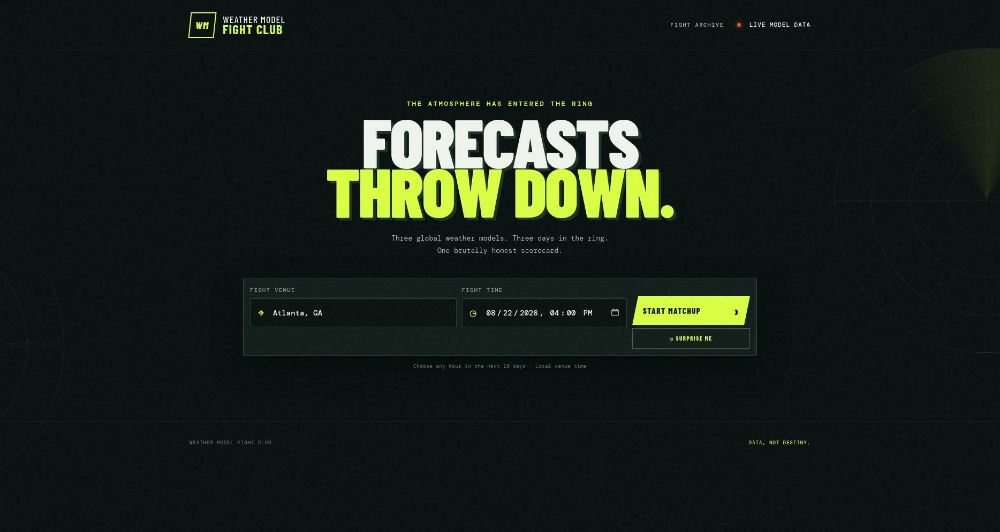
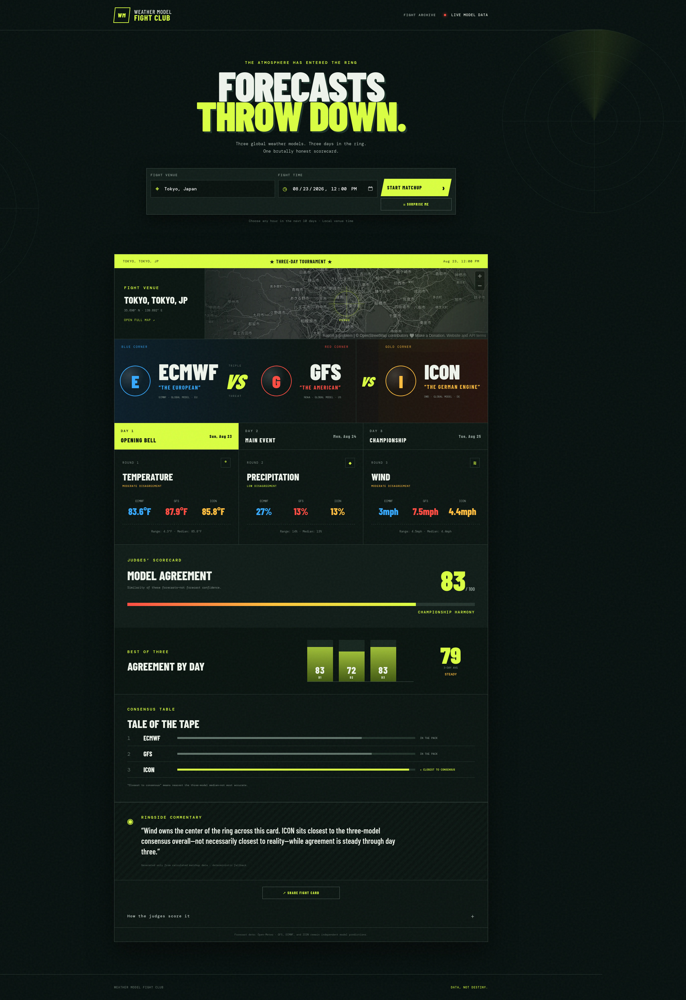
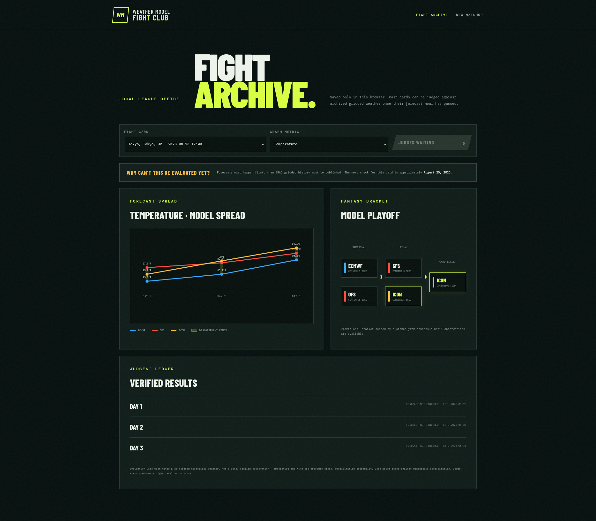

# Weather Model Fight Club

> Three global weather models. Three days in the ring. One brutally honest scorecard.

Weather forecasts often look authoritative while quietly disagreeing with one another. **Weather Model Fight Club** makes that uncertainty visible by turning a multi-model forecast comparison into a fight-night scorecard anyone can understand.

Enter a location and forecast time, and the app compares three global weather models across temperature, precipitation probability, and wind speed for three consecutive days. It shows where the models agree, where they diverge, and which model is closest to consensus—without presenting agreement as certainty or accuracy.

Built for the Kane CLI Hackathon 2026.

## Demo

- **Live app:** [kane-cli-hackathon-2026.vercel.app](https://kane-cli-hackathon-2026.vercel.app/)
- **Video walkthrough:** _Add the Loom or YouTube URL before submission_



## Product tour

### The full fight card

From one location and forecast time, the matchup expands into model values, day-by-day rounds, an agreement score, a three-day trend, the consensus table, and grounded ringside commentary.

<details>
<summary>View the complete matchup screen</summary>



</details>

### Fight Archive

Saved cards become a local forecast journal with model-spread charts, a fantasy bracket, evaluation scheduling, and a judges’ ledger for completed rounds.



## Why this exists

Most consumer weather apps show a single forecast. Behind that number are multiple numerical weather prediction models that can disagree substantially, especially several days out. That spread is useful information: it tells a user when the forecast is stable and when they should prepare for multiple outcomes.

Weather Model Fight Club translates that technical comparison into a visual format that is fast to scan, fun to explore, and careful about what the data can actually prove.

## Features

- Compare any three supported global forecast models over three consecutive days.
- Score model agreement across temperature, precipitation probability, and wind.
- See low, moderate, or high disagreement for each weather metric.
- Identify the model closest to the median forecast—not a falsely declared “winner.”
- Track whether the models are converging or diverging across the three-day card.
- Use **Surprise Me** to generate a random location, time, and model roster.
- Save fight cards automatically in a browser-local archive.
- Visualize forecast trajectories and model spread in the Fight Archive.
- Evaluate completed forecast hours against Open-Meteo ERA5 gridded historical weather.
- Continue working without an LLM: all scoring and commentary are deterministic.
- Handle missing model values by excluding unavailable metrics instead of inventing data.

## Supported models

The default matchup uses:

- GFS — NOAA, United States
- ECMWF IFS — European Centre for Medium-Range Weather Forecasts
- ICON — Deutscher Wetterdienst, Germany

The randomized roster can also draw from GEM, JMA, and UKMO Global. ACCESS-G is recognized by the provider adapter but is not included in random draws because the unified provider endpoint can return an empty hourly series for it.

## How it works

```text
Location + time
      │
      ▼
Open-Meteo geocoding and multi-model forecast APIs
      │
      ▼
Forecast normalization (src/weather.js)
      │
      ├──► Agreement tournament (src/agreement.js)
      │         │
      │         ├──► Three-day scorecard and trend
      │         └──► Grounded deterministic commentary
      │
      └──► Browser-local Fight Archive
                    │
                    ▼
        ERA5 historical evaluation after the hour passes
```

The frontend never interprets raw weather-provider payloads. The server converts provider data into a small, consistent structure before it reaches the scoring engine or UI.

## Model Agreement score

Model Agreement measures similarity between forecasts. It is **not** a confidence percentage, an accuracy score, or a probability that the forecast will happen.

For each metric, the tournament calculates the range between the highest and lowest available model values:

```text
normalized penalty = min((maximum − minimum) / metric cap, 1)
agreement = round(100 × (1 − weighted penalty / available weight))
```

| Metric | Weight | Difference cap |
| --- | ---: | ---: |
| Temperature | 35% | 20°F |
| Precipitation probability | 40% | 100 percentage points |
| Wind speed | 25% | 30 mph |

At least two model values are required for a metric. If fewer are available, that metric and its weight are excluded from the score. “Closest to consensus” means the smallest normalized distance from the per-metric median.

## Historical evaluation

Once an archived forecast hour is in the past, the app can compare it with Open-Meteo ERA5 gridded historical weather. ERA5 is a historical estimate, not a reading from a local weather station, and recent data may be delayed.

| Metric | Weight | Method |
| --- | ---: | --- |
| Temperature | 40% | Absolute error, capped at 20°F |
| Wind speed | 25% | Absolute error, capped at 30 mph |
| Precipitation | 35% | Brier score against precipitation of at least 0.004 inches |

Historical evaluation is separate from Model Agreement. Agreement answers “how similar were the forecasts?” Evaluation answers “which forecast was closest to the later historical estimate?”

## Tech stack

- Node.js 20+
- Native Node HTTP server and Fetch API
- Vanilla HTML, CSS, and JavaScript
- Open-Meteo forecast, geocoding, and historical APIs
- Browser `localStorage` for the archive
- Node’s built-in test runner
- Vercel for production hosting

There are no runtime npm dependencies, API keys, accounts, databases, or paid services required for local development.

## Run locally

Requirements: Node.js 20 or newer and an internet connection for live Open-Meteo requests.

```bash
git clone https://github.com/mso-docs/Kane-CLI-Hackathon-2026.git
cd Kane-CLI-Hackathon-2026
npm start
```

Open [http://localhost:3000](http://localhost:3000).

For automatic restarts while editing:

```bash
npm run dev
```

No `.env` file is needed.

## Testing

Run the deterministic unit and adapter tests:

```bash
npm test
```

The suite covers agreement scoring, missing-value behavior, three-day evaluation, provider response normalization, and historical observation normalization.

Suggested end-to-end checks before release:

1. Run a matchup for a valid city and confirm three models and three days appear.
2. Change the forecast time and confirm the displayed values update.
3. Try an invalid location and confirm a useful error is shown.
4. Run **Surprise Me** and confirm the model roster changes.
5. Open the Fight Archive and inspect the saved card and graphs.
6. Check the layout at a mobile viewport.
7. Confirm upstream-provider failures produce a recoverable error state.

Kane-generated browser test specifications and reports are stored under `.testmuai/tests/`. Two current primary-flow runs pass; an earlier run stopped because its screenshot operation timed out before executing the test flow.

## Privacy and resilience

- Saved fight cards stay in the current browser’s `localStorage` and are capped at 30 entries.
- No user account or personal profile is created.
- No location history is uploaded by the archive feature.
- No LLM receives weather or user data.
- Deterministic commentary keeps the experience available without an AI provider.

## Current limitations

- Forecasts and historical comparisons depend on Open-Meteo availability.
- ERA5 data is gridded historical weather, not a station observation, and can arrive several days late.
- Agreement describes model similarity only; several models can agree and still be wrong.
- The archive is browser-local and does not sync across devices.
- Embedded maps and web fonts require access to their external providers.

## Video walkthrough outline

A concise 2–3 minute submission video can follow this sequence:

1. **Problem:** most apps hide disagreement behind one forecast.
2. **Core demo:** enter a city and start a three-model matchup.
3. **Interpretation:** show the three metric rounds, agreement score, and consensus leader.
4. **Depth:** switch days and point out the converging/diverging series trend.
5. **Replay value:** use **Surprise Me** and open the Fight Archive.
6. **Validation:** explain historical evaluation and the distinction between agreement and accuracy.
7. **Technical close:** mention deterministic scoring, graceful missing-data handling, zero API keys, and automated tests.

## Project structure

```text
.
├── public/             # Main UI, archive UI, styles, and browser evaluation logic
├── src/
│   ├── agreement.js    # Agreement tournament and three-day summary
│   ├── commentary.js   # Deterministic grounded commentary
│   ├── evaluation.js   # Shared historical evaluation export
│   ├── observed.js     # ERA5 historical-weather adapter
│   └── weather.js      # Geocoding, forecast retrieval, and normalization
├── test/               # Deterministic Node tests
├── server.js           # Static server and JSON API routes
└── package.json
```

## Data attribution

Forecast, geocoding, and historical weather data are provided through [Open-Meteo](https://open-meteo.com/). Forecast model names and provider attribution remain visible in the interface.

## Submission checklist

- [x] Deploy the production build
- [x] Add the production URL to the README
- [ ] Record and upload the walkthrough video
- [ ] Add the Loom or YouTube URL above
- [x] Add a strong hero screenshot
- [x] Run `npm test` one final time
- [ ] Verify the submitted repository branch contains the latest commit
